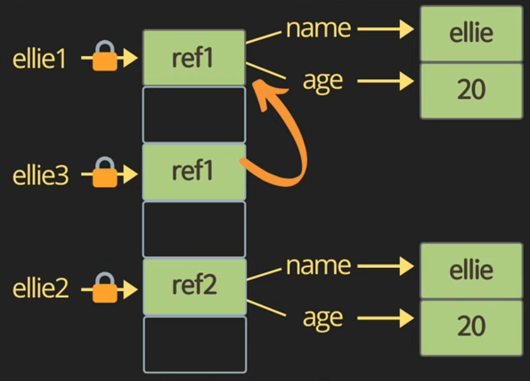

# 3. 연산/ 반복문

## 1. String concatenation(문자열 연결)

```jsx
console.log('my' + ' cat');
console.log('1' + 2);
console.log(`string literals:
'''''
1 + 2 = ${1 + 2}`);
console.log("ellie's \n\tbook");
```

## 2. Numeric(숫자) operators

```jsx
console.log(1 + 1);
console.log(1 - 1);
console.log(1 / 1);
console.log(1 * 1);
console.log(1 % 1); // 나머지
console.log(1 ** 1); // 제곱
```

## 3. Increment(증가), decrement(감소) operators

```jsx
// ++ / --
let counter = 2;

const preIncrement = ++counter;
// counter = counter + 1;
// preIncrement = counter;
console.log(`preIncrement: ${preIncrement}, counter: ${counter}`); // > 3, 3 : 바로 업데이트 되서 할당

const postIncrement = counter++;
// postIncrement = counter;
// counter = counter + 1;
console.log(`postIncrement: ${postIncrement}, counter: ${counter}`); // > 3, 4 : 할당 해놓고 업데이트

// 마이너스도 같음
```

## 4. Assignment(할당) operators

```jsx
// =
let x = 3;
let y = 6;
x += y; // x = x + y;
x -= y;
x *= y;
x /= y;
```

## 5. Comparison(비교) ≤ operators

```jsx
console.log(10 < 6); // > false
console.log(10 <= 6); // > false
console.log(10 > 6); // > true
console.log(10 >= 6); // > true
```

## 6. Logical(논리적) operators ( ||or &&and ! not)

```jsx
const value1 = true;
const value2 = 4 < 2; // > flase

// || (or), 첫 번째 true 값을 찾습니다.
console.log(`or: ${value1 || value2 || check()}`); // > value1에서 멈춤

// && (and), 첫 번째 false 값을 찾습니다.
console.log(`or: ${value1 && value2 && check()}`); // > value2에서 멈춤

function check() {
	for (let i = 0; i < 10; i++) {
		// wasting time
		console.log('♬');
	}
	return true;
}

// ! (not)
console.log(!value1) // > false
```

<aside>
💡 논리 연산을 할 때는, 연산량이 많은 함수를 뒤 쪽에 배치시키는게 효율적!

</aside>

## 7. Equality(평등) operators

```jsx
const stringFive = `5`;
const numberFive = 5;

// == loose 느슨한 equality, type 변환 포함
console.log(stringFive == numberFive);
console.log(stringFive != numberFive);

// === strict엄격한 equality, type 변환 없음
console.log(stringFive === numberFive);
console.log(stringFive !== numberFive);
```

<aside>
💡 Equality 연산을 할 때는, ===, !== 를 사용하자

</aside>

```jsx
// reference(주소)에 의한 object equality
const ellie1 = { name: `ellie`, age: 20 };
const ellie2 = { name: `ellie`, age: 20 };
const ellie3 = ellie1;
console.log(ellie1 == ellie2); // > false
console.log(ellie1 === ellie2); // > false
console.log(ellie1 == ellie3); // > true
console.log(ellie1 === ellie3); // > true
```



<aside>
💡 object는 메모리에 탑재될 때, 주소가 저장되므로 같은 data를 할당 해도 비교시 false가 된다.

</aside>

```jsx
// equality - 퀴즈
console.log(0 == false); //0, null, undefined, empty는false로 간주될 수 있다.  그래서 true
console.log(0 === false); // 그러나 0은 boolean type이 아니기에 false
console.log('' == false); //  empty문자열은 false이므로 true
console.log('' === false); // empty문자열은 booleantyle이 아니기에 false
console.log(null == undefined); // null과 undefined는 같은 걸로 간주되지만 true
console.log(null === undefined); // null과 undefined은 다른 타입이라 false
```

## 8. Conditional(조건부) operators * if, else if, else : highlight

```jsx
const name = `df`;
if (name === `ellie`) {
  console.log(`Welcome, Ellie!`);
} else if (name === `coder`) {
  console.log(`You are amazing coder`);
} else {
  console.log(`unkwnon`);
}
```

## 9. Ternary(삼항) operators  - else 좀 더 간단하게 간단할때만 사용

```jsx
// 조건 ? value1 : value2;
const name = `df`;
console.log(name === `ellie` ? `yes` : `no`); // no 출력
// 조건이 true면 ':' 기준 왼쪽 값 출력, false면 오른쪽 값 출력
```

## 10. Switch statement(스위치 문)

```jsx
// 여러 if 검사에 사용
// 열거 형 값(enum-like value) 확인에 사용
// TS에서 여러 type 검사에 사용
const browser = `IE`;
switch (browser) {
  case `IE`:
    console.log(`go away!`);
    break;
  case `Chrome`:
  case `Firefox`:
    console.log(`love you!`);
    break;
  default:
    console.log(`some all!`);
    break;
}
```

## 11. While Loops  * highlight, false나오기 전까지 무한대로 반복

```jsx
// while loop 조건이 맞을때만 블럭을 시작하고 싶으면 while
let i = 3;
while (i > 0) {
  console.log(`while: ${i}`);
  i--;
}
```

```jsx
// do while loop : 먼저 블록을 실행한 뒤에 조건이 맞는지 안맞는지. 
// {} 안에 코드가 한 번 실행 되고 조건을 체크함
let i = 3;
do {
  console.log(`do while: ${i}`);
  i--;
} while (i > 0);
```

```jsx
// for loop , begin한번만 호출하고, 컨디션맞는지 검사, 블록실행하고 나면 그 다음 동작
// for(begin; condition; step)
for (i = 3; i > 0; i--) {
  console.log(`for: ${i}`);
}

for (let i = 3; i > 0; i--) {
  // 인라인 변수 선언 블럭안에 let 지역변수 선언해서 작성하는 것도 좋다.
  console.log(`inline variable for: ${i}`);
}
```

```jsx
// nested loops  - big o 가 n 의 2승이다. cpu에 좋지 않다. - 피해야함

for (let i =0; i < 10; i++) {
	for (let j = 0; j < 10; j++){
		console.log(`i: ${i}, i:${i}`);
	}
}
```

```jsx
//break, continue
// 1. 
for (let i = 0; i<=10; i++){
	if ( i % 2 !== 0 ){
		continue;
	}
	console.log(`q1. ${i}');

]
// 2.

for (let i =0; i<=10 ; i++){
	if i < 8 
	console.log(`${i}`); 
	else :
break
}
```

```jsx
// Q1. 0에서 10까지 반복하고 짝수 만 인쇄 (continue 사용)
for (let i = 0; i <= 10; i++) {
  if ( (i % 2) !== 0 ) continue
  console.log(i)
}

// Q2. 0에서 10까지 반복하고 8에 도달 할 때까지 숫자를 인쇄합니다 (break 사용)
for (let i = 0; i <= 10; i++) {
  // console.log(`break: ${i}`);
  // if (i === 8) break;
  if (i > 8) break;
  console.log(`break: ${i}`);
}
```

출처 : [드림코딩 by 엘리 JS 강의 정리](https://www.youtube.com/watch?v=tJieVCgGzhs&list=PLv2d7VI9OotTVOL4QmPfvJWPJvkmv6h-2&index=3)